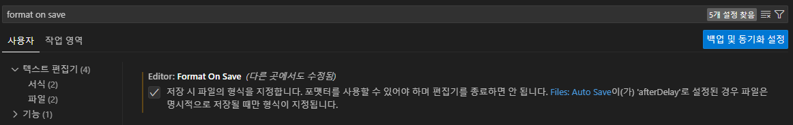

# HTML, CSS

- 기본설정
  - VSCode 사용
  - 확장에서 Live Server(html-중요), Prettier - code formatter(다른언어가능) ,HTML CSS Support(html), Material Icon Theme(그외), Color Highlight(html, css), Git Graph(git) 설치
- emmet

- prettier 설정방법
  - ctrl + shift + p
  - Format Document 검색
  - prettier 설정
  - 설정으로 이동
  - 

### 1일차

#### 자주쓰는 태그와 특징

- ` ` : 한 줄 넘김
- `` : 사이트 연결
  - 페이지 내 원하는 태그로 이동
  - 이동하고자 하는 태그 속성에 `id ="[아이디이름]"` 부여
  - ``
- `

` : 여백없음, 한 줄 사용
- `` : 여백없음
- `

` : 위아래로 한 줄씩 여백
- `<pre></pre>` : 양식 그대로
- `<b></b>` : 굵은 글씨
- `<strong></strong>` : 굵은 글씨, b와 차이 없음, 시맨틱 태그
- `
` : 라인 생성
- `<i></i>` : 기울어진 글씨
- `<em></em>` : 기울어진 글씨, i와 차이 없음, 시맨틱 태그
- `<small></small>` : 작게 표시
- `` : H2O
- `` : 100m2
- `<abbr title=""></abbr>` : 줄임말 표시
- `<cite></cite>` : 출처 표기 시 사용
- `<code></code>` : 코드 표기시
- `<mark></mark>` : 하이라이트 표시

- 시맨틱 태그를 사용하는 이유

  - <mark>접근성 향상</mark>: <em>스크린리더(시각장애인용 프로그램)내용을 이해하기 쉬움</em>
  - <mark>검색 앤진 최적화(SEO)</mark>: <em>구글과 같은 검색 엔진이 페이지 구조를 더 잘 파악</em>
  - <mark>코드 가독성 향상</mark>: <em>다른 개발자가 봤을 때도 구조와 의미를 파악하기 쉬움</em>
  - <mark>미래 호환성 확보</mark>: <em>HTML5 이후부터 의미 기반 문서 구조가 중요한 기준이 됨</em>

- a태그

- `<fieldset>, <legend>`
  - 박스형 만드는 태그

### 2일차

- label
  - label id == input id 같게해야 좋음
- input 속성 id, class
  - class: 중복 가능, 띄어쓰기로
  - id: 중복불가

#### 사용자 입력 input type 태그 종류

- `<input type="submit" />` : 제출 버튼
- `<input type="text" />`
- `<input type="password" />`
- `<input type="date" />`
- `<input type="time" name="time" id="" />`
- `<input type="file">`
- `<input type="hidden" name="" value=""/>` : 데이터전송용, 안보임

#### 리스트

##### 순서있는 리스트(Ordered List)

- ol>li

##### 순서없는 리스트(Unordered List)

- ul>li

##### 정의리스트(Description List)

- 정의리스트: 용어 정의와 같이 특정한 내용에 대한 정의를 구성하는 태그이고,
- `<dl></dl>`:
- `<dt></dt>`: 혼자 사용 가능
- `<dd></dd>`:

#### 테이블만들기

- table>tr>td

### 3일차

### 4일차

### 5일차

- 축약형 일반방식
- ex) padding : 4가지 인자 받을 수 있음
  - 1가지가능: 5px -> 위아래좌우: 5px
  - 2가지가능: 5px 10px -> 위아래: 5px , 좌우: 10px
  - 3가지가능: 5px 10px 8px -> 위: 5px , 아래: 8px, 좌우:10px
  - 4가지가능: 5px 10px 8px 9px -> 위: 5px, 우:10px, 아래: 8px, 좌:9px

### 6일차

### 7일차

- google forms에 연동
  - 구글 설문 양식 작성
  - 설문작성 페이지에서 f12로 form 태그의 `POST` -> `GET`으로 변경
  - 설문 제출 후 물음표 뒤 확인
  - f12 -> Network -> formResponse?에서도 확인 가능
- GET(읽기) 물음표를 기준으로 뒤에 커리를 넣음
- POST(쓰기) 폼데이터에 담겨서 전송
