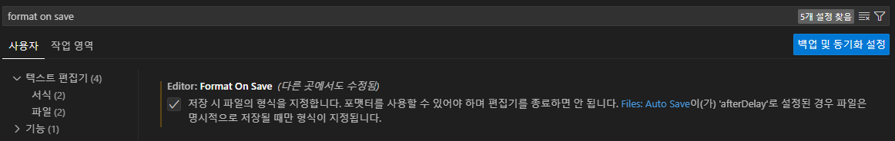

# HTML, CSS

- 기본설정
  - VSCode 사용
  - 확장에서 Live Server(html-중요), Prettier - code formatter(다른언어가능) ,HTML CSS Support(html), Material Icon Theme(그외), Color Highlight(html, css), Git Graph(git) 설치
- emmet

- prettier 설정방법
  - ctrl + shift + p
  - Format Document 검색
  - prettier 설정
  - 설정으로 이동(이것만 해도 됨)
  - 

### 1.일차

- 자주쓰는 태그와 특징

  - ` ` : 한 줄 넘김
  - `` : 사이트 연결
  - `

` : 여백없음, 한 줄 사용
  - `` : 여백없음
  - `

` : 위아래로 한 줄씩 여백
  - `<pre></pre>` : 양식 그대로
  - `<b></b>` : 굵은 글씨
  - `<strong></strong>` : 굵은 글씨, b와 차이 없음, 시맨틱 태그
  - `
` : 라인 생성
  - `<i></i>` : 기울어진 글씨
  - `<em></em>` : 기울어진 글씨, i와 차이 없음, 시맨틱 태그
  - `` : H2O
  - `` : 100m2
  - `<abbr title=""></abbr>` : 툴팁 기능
  - `<cite></cite>` : 출처 표기 시 사용
  - `<code></code>` : 코드 표기시

- 시맨틱 태그를 사용하는 이유
  <mark>접근성 향상</mark>: <em>스크린리더(시각장애인용 프로그램)내용을 이해하기 쉬움</em>
  <mark>검색 앤진 최적화(SEO)</mark>: <em>구글과 같은 검색 엔진이 페이지 구조를 더 잘 파악</em>
  <mark>코드 가독성 향상</mark>: <em>다른 개발자가 봤을 때도 구조와 의미를 파악하기 쉬움</em>
  <mark>미래 호환성 확보</mark>: <em>HTML5 이후부터 의미 기반 문서 구조가 중요한 기준이 됨</em>
